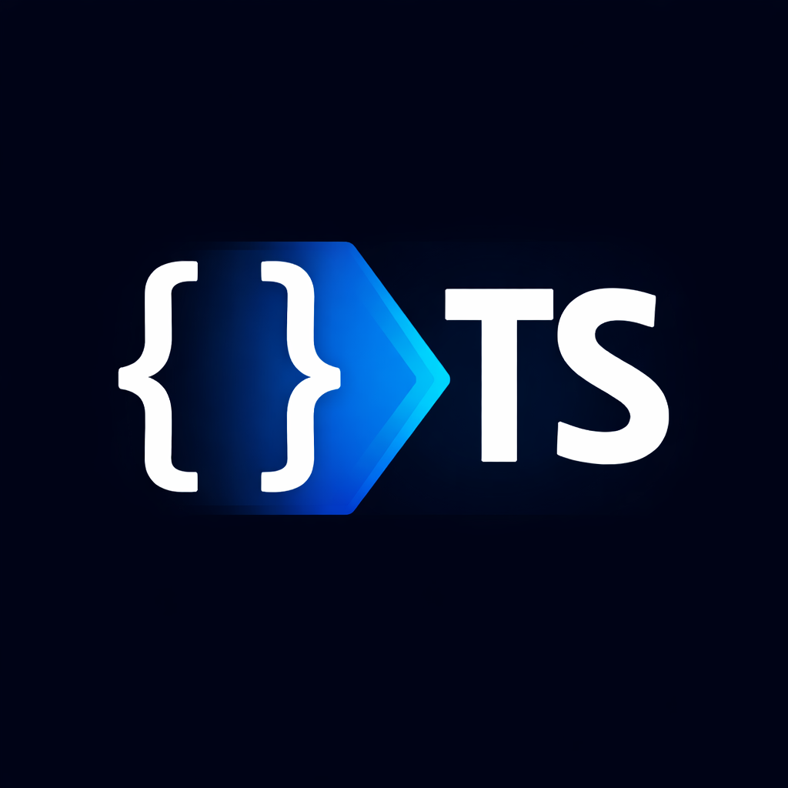

<div align="center">



# schemaQL

**Sequelize model diffs → SQL migrations. Instantly.**

[](https://marketplace.visualstudio.com)
[](./LICENSE)
[](https://sequelize.org)

> Stop writing migration SQL by hand. schemaQL reads your git changes, finds your updated Sequelize models, and generates the SQL — right inside VS Code.

</div>

---

## The problem it solves

You update a Sequelize model. Now you need a migration. So you open a new file, write `CREATE TABLE` or `ALTER TABLE`, copy-paste column names, map types manually, check nullability... and hope you didn't miss anything.

**schemaQL eliminates that loop entirely.**

---

## How it works

```
your git changes
      │
      ▼
schemaQL reads changed model files
      │
      ▼
detects new models / new columns
      │
      ▼
SQL appears in a new editor tab ✨
```

Open the Command Palette and run:

```
schemaQL: Generate Migration
```

That's it.

---

## Quick example

You add a new model:

```ts
newtable.init(
  {
    name: {
      type: DataTypes.STRING(300),
      allowNull: false,
    },
    isActive: {
      type: DataTypes.BOOLEAN,
      allowNull: true,
    },
  },
  {
    sequelize,
    modelName: "newtable",
  }
);
```

schemaQL generates:

```sql
CREATE TABLE newtable (
  name VARCHAR(300) NOT NULL,
  isActive BOOLEAN NULL
);
```

You add a new column to an existing model:

```ts
newcol: {
  type: DataTypes.STRING(300),
  allowNull: false,
}
```

schemaQL generates:

```sql
ALTER TABLE your_table ADD COLUMN newcol VARCHAR(300) NOT NULL;
```

---

## What it detects

| Scenario | Output |
|---|---|
| New model file | `CREATE TABLE ...` |
| New column in existing model | `ALTER TABLE ... ADD COLUMN ...` |
| Multiple models changed at once | One SQL block per model |

---

## Type mapping

| Sequelize | SQL |
|---|---|
| `DataTypes.STRING` | `VARCHAR(255)` |
| `DataTypes.STRING(300)` | `VARCHAR(300)` |
| `DataTypes.CHAR(10)` | `CHAR(10)` |
| `DataTypes.INTEGER` | `INT` |
| `DataTypes.BOOLEAN` | `BOOLEAN` |
| `DataTypes.DECIMAL(10,2)` | `DECIMAL(10,2)` |

---

## Table name resolution

schemaQL looks for `tableName` in your model options first. If it's missing, it falls back to `modelName`. No config needed.

---

## Null handling

| Model definition | SQL output |
|---|---|
| `allowNull: false` | `NOT NULL` |
| `allowNull: true` | `NULL` |
| `allowNull` omitted | *(unspecified)* |

---

## Requirements

- A VS Code workspace must be open
- Your project uses Sequelize-style `Model.init(...)` models
- Schema changes exist in your current git working tree (staged or unstaged)

---

## Command reference

| | |
|---|---|
| **Command Palette** | `schemaQL: Generate Migration` |
| **Command ID** | `schemaql.generateMigration` |

---

## Current scope

schemaQL is focused and intentional. Right now it handles:

- ✅ New model creation
- ✅ New columns on existing models
- ✅ `tableName` / `modelName` resolution
- ✅ Core Sequelize types
- ✅ Null constraint generation
- ✅ Multiple changed models in a single run

Not yet supported:

- ⬜ Column removal
- ⬜ Column renaming
- ⬜ Type changes on existing columns
- ⬜ Constraints beyond nullability
- ⬜ Non-standard model definitions

---

## License

[MIT](./LICENSE)